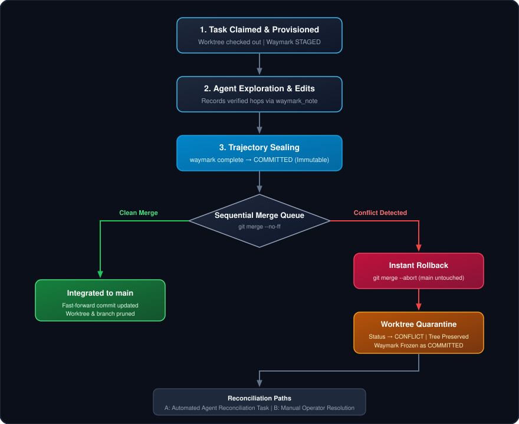

# Arbiter: Local-First Multi-Agent Orchestration & Ephemeral Worktree Supervisor

> **Empirical Multi-Agent Benchmark:** Across parallel agent swarms, Arbiter provisions isolated ephemeral Git worktrees in **~300ms**, resolves 50-node task dependency DAGs in **<4ms**, and detects dead agent processes with lock reclamation in **~1ms**—all powered by Node 22 native SQLite with **0 runtime npm dependencies** (<6 MB heap). Conflicted merges rollback cleanly in **<80ms** with zero dirty state left on `main`. (Reproduce via `npm run benchmark`).

---

## Table of Contents

- [Why Use It?](#why-use-it)
- [Cross-Repository Ecosystem](#cross-repository-ecosystem)
- [The Multi-Agent Chaos Problem](#the-multi-agent-chaos-problem)
- [Quick Start & Agentic Installation](#quick-start--agentic-installation)
- [Arbiter's Core Architecture](#arbiters-core-architecture)
- [Dual Interface: MCP & Operator CLI](#dual-interface-mcp--operator-cli)
- [Waymark Trajectory Conflict Handling & Quarantine](#waymark-trajectory-conflict-handling--quarantine)
- [Release Discipline & Verification](#release-discipline--verification)

---

## Cross-Repository Ecosystem

This repository is part of an integrated, local-first multi-agent execution suite:

### Internal Suite Repositories

| Repository | Role & Responsibility | Core Invariant |
| :--- | :--- | :--- |
| **[`AGENTS.md Compact Reload`](https://github.com/paragon-ux/codex-agents-compact-reload)** | Static project governance & compaction survival. | Re-injects verified `AGENTS.md` and SHA-256 hash on context compaction. |
| **[`Waymark`](https://github.com/paragon-ux/waymark)** | In-flight continuity ledger & AST discovery MCP. | Preserves verified code hops (`.waymark/`) across compactions (<216 tokens). |
| **[`Arbiter`](https://github.com/paragon-ux/Arbiter)** | Multi-agent DAG orchestrator & worktree supervisor. | Enforces `1 Task : 1 Worktree : 1 Trajectory`; fail-closed merge quarantine. |

#### When to Use What

- **Use [`AGENTS.md Compact Reload`](https://github.com/paragon-ux/codex-agents-compact-reload)** when an agent harness compacts context and you must deterministically guarantee that static project instructions, safety guardrails, and coding conventions are restored into the active session without spending agent recovery turns.
- **Use [`Waymark`](https://github.com/paragon-ux/waymark)** when an agent is deep in a multi-file investigation or code trace and needs to preserve dynamic, verified line spans and causal breadcrumbs across compactions without repetitive, token-expensive codebase re-reads.
- **Use [`Arbiter`](https://github.com/paragon-ux/Arbiter)** when running multiple autonomous coding agents in parallel and you need ephemeral Git worktree isolation, DAG task dependencies, zero-daemon dead-worker recovery, and conflict-quarantined sequential merges.

> [!IMPORTANT]
> **The 1:1:1 Invariant Contract**:
> Every concurrent agent worker provisioned by **Arbiter** operates in exactly **one isolated Git worktree** and records exactly **one active Waymark trajectory**. Context compaction reloads static rules via **`AGENTS.md Compact Reload`** and in-flight hops via **`Waymark`** without mutating the task lease or crossing branch boundaries.

### External Specifications

| Specification | Canonical Reference | Usage in Suite |
| :--- | :--- | :--- |
| **Model Context Protocol (MCP)** | [Model Context Protocol Specification](https://github.com/modelcontextprotocol/specification) | Standardized JSON-RPC 2.0 stdio tool interface used across Waymark and Arbiter. |
| **Tree-sitter WASM** | [Tree-sitter](https://github.com/tree-sitter/tree-sitter) | Polyglot AST grammars compiled to WebAssembly for zero-dependency symbol discovery. |
| **Node.js Core Runtime** | [Node.js](https://github.com/nodejs/node) (v22+ LTS) | Native `node:sqlite`, `node:child_process`, `node:crypto`, `node:fs` (0 runtime npm dependencies). |
| **Capn Hook / Memory Protocol** | [Capn Hook](https://github.com/cyrusNuevoDia/capn-hook) | Finalized episodic memory storage, distinct from Waymark's active in-flight trajectory ledger. |

---

## Why Use It?

| Approach | Worktree & File Isolation | In-Flight Agent Continuity | Conflict & Rollback Protection | Host Footprint & Overhead |
| :--- | :--- | :--- | :--- | :--- |
| **Single-Branch Free-For-All** | **None.** Agents overwrite each other's edits directly. | Lost on context compaction or crash. | Zero. Broken builds and conflict markers on `main`. | Minimal, but code corruption is guaranteed. |
| **Branch-Per-Agent (Manual PRs)** | Partial. Requires manual branch switching and local stashing. | None. In-flight reasoning is lost across turns. | Manual Git resolution by a human engineer. | High human review bottleneck; slow agent turnarounds. |
| **Heavy Daemon Orchestrators** | High (full Docker containers or Kubernetes pods). | Vendor lock-in; heavy telemetry agents. | Complex container teardown and staging branches. | **Extreme** (GBs of RAM, background daemons, cloud bills). |
| **Arbiter Engine** | **100% Isolated.** Ephemeral Git worktrees (`.arbiter/worktrees/`). | **Native Waymark integration** (sealed before merge). | **Instant rollback (`git merge --abort`)** + quarantine. | **Zero Daemons.** Pure Node 22 (`node:sqlite`), <6 MB heap. |

Arbiter coordinates parallel coding agents without breaking your repository, stomping active working copies, or requiring heavy background Docker daemons.

---

## The Multi-Agent Chaos Problem

Running multiple autonomous coding agents in the same repository simultaneously usually results in four critical failure modes:

1. **Stomped Files**: Agent B edits `server.ts` while Agent A is half-way through refactoring it. Both agents get confused by phantom changes, hallucinate fixes, and destroy each other's progress.
2. **Polluted Working Trees**: An agent leaves untracked test files or half-applied patches. When another agent runs unit tests, the tests fail because of someone else's dirty working directory.
3. **Context Thrashing**: When an agent context-compacts in the middle of a multi-file task, it forgets why it touched those files and re-reads the entire repository from scratch, burning tens of thousands of tokens.
4. **Crashed Agent Deadlocks**: If an agent process crashes or is killed by an IDE window reload, its locks and claimed tasks sit abandoned forever.

### How Arbiter Solves It
- **Isolated Worktrees**: Every claimed task runs in its own ephemeral worktree (`.arbiter/worktrees/task-<id>`) on a dedicated branch (`arbiter/task-<id>`). Parallel agents never see each other's in-progress files.
- **In-Flight Continuity with Waymark**: Each task automatically stages a Waymark trajectory. Verified code hops are recorded with `waymark_note`, surviving context compaction without token waste.
- **Autonomous Watchdog**: Arbiter's zero-daemon watchdog checks process liveness via non-destructive OS signaling (`process.kill(pid, 0)`). If an agent dies, its lock is reclaimed and the task is re-queued automatically.
- **Sequential Merge Queue with Quarantine**: Completed tasks merge into `main` one at a time. If overlapping changes cause a conflict, Arbiter aborts the merge instantly (`git merge --abort`), keeping `main` pristine, and quarantines the worktree for inspection.

---

## Quick Start & Agentic Installation

### 1. Build and Verify
Arbiter requires **Node.js $\ge 22.0.0$** (for native `node:sqlite`) and **Git $\ge 2.20$**.

```bash
git clone https://github.com/paragon-ux/Arbiter.git
cd Arbiter
npm install
npm run verify
```

### 2. Client MCP Registration
Register Arbiter in your agent's MCP configuration (`claude_desktop_config.json`, Cursor, Antigravity, or Cline):

```json
{
  "mcpServers": {
    "arbiter": {
      "command": "node",
      "args": ["<path-to-arbiter>/dist/src/mcp/index.js"]
    }
  }
}
```

### 3. The 4-Step Agent Workflow
When interacting with Arbiter, autonomous coding agents follow a straightforward lifecycle:

1. **Claim a Task**: Call `arbiter_claim_task({ worker_id: "<id>" })`. Arbiter provisions an isolated worktree and stages a Waymark trajectory.
2. **Work Inside the Worktree**: Change into the returned `worktree_path`. Write code, run tests, and record verified hops via `waymark_note`.
3. **Checkpoint Progress**: Call `arbiter_checkpoint({ task_id, worker_id, message })` to refresh the lease heartbeat.
4. **Complete & Seal**: Call `arbiter_complete_task({ task_id, worker_id, answer })`. Arbiter seals the Waymark trajectory, commits worktree changes, and enqueues the branch for merge into `main`.

---

## Arbiter's Core Architecture

```
Antigravity-Project/
└── Arbiter/
    ├── package.json                   # Zero runtime npm dependencies
    ├── README.md                      # Presentation & operational guide
    ├── control/
    │   ├── CONTRACTS.md               # Safety invariants and product boundaries
    │   └── OWNERSHIP.md
    ├── src/
    │   ├── db/                        # node:sqlite persistence (tasks, DAG dependencies, leases)
    │   ├── dag/                       # TaskGraph (topological sort, Kahn cycle check) & TaskService
    │   ├── worktrees/                 # WorktreeManager (git worktree isolation & lifecycle)
    │   ├── waymark/                   # WaymarkSupervisor (CLI bridge, auto-init, trajectory seal)
    │   ├── merge/                     # MergeQueue (sequential merge to main & conflict quarantine)
    │   ├── dispatch/                  # LeaseWatchdog (dead-PID detection via process.kill(pid, 0))
    │   ├── mcp/                       # JSON-RPC 2.0 stdio MCP server (11 native tools)
    │   └── cli/                       # Operator CLI (submit, claim, checkpoint, complete, merge)
    └── test/                          # 14 unit & integration test suites
```

---

## Dual Interface: MCP & Operator CLI

Arbiter maintains complete parity between agent tools and operator commands:

| Capability | Agent MCP Tool | Operator CLI Command | Description |
| :--- | :--- | :--- | :--- |
| **Submit Task** | `arbiter_submit_task` | `arbiter submit` | Enqueue a task with optional DAG dependencies (`--deps`). |
| **Claim Task** | `arbiter_claim_task` | `arbiter claim` | Claim next ready task, provision isolated worktree & stage Waymark. |
| **Checkpoint** | `arbiter_checkpoint` | `arbiter checkpoint` | Record progress milestone and refresh worker lease heartbeat. |
| **Complete Task**| `arbiter_complete_task` | `arbiter complete` | Seal Waymark trajectory, commit worktree files, unblock child tasks. |
| **Fail Task** | `arbiter_fail_task` | `arbiter fail` | Abandon Waymark trajectory and report error diagnostics. |
| **Recover Lock** | `arbiter_recover_lock` | `arbiter recover-lock`| Safely inspect or reclaim orphaned Waymark locks in worktrees. |
| **Status Check** | `arbiter_status` | `arbiter status` | View queue topology, active leases, or specific task details. |
| **Merge Queue** | `arbiter_process_merge_queue` | `arbiter merge` | Sequentially merge completed task branches into `main`. |
| **Watchdog Scan**| `arbiter_scan_leases` | `arbiter watchdog` | Scan active leases for dead PIDs or timeouts and reset tasks. |
| **Prune Trees** | `arbiter_prune_worktrees` | `arbiter prune` | Delete completed/failed ephemeral worktrees and branches. |
| **Cluster Metrics**| `arbiter_metrics` | `arbiter metrics` | Inspect task state distribution, active leases, and event counts. |

---

## Waymark Trajectory Conflict Handling & Quarantine

A core design invariant is that **Git merge conflicts never destroy or corrupt Waymark continuity data**. The quarantine lifecycle follows a fail-closed sequence (detailed architectural rationale in [Rationale.MD](Rationale.MD)):

<p align="center">
  
</p>

```
[1. Task Claimed (STAGED)]
          │
          ▼
[2. Agent Edits & Notes (waymark_note)]
          │
          ▼
[3. Complete Task (waymark complete -> COMMITTED)]
          │
          ▼
<4. Sequential Merge Queue (git merge --no-ff)>
      ├── Clean Merge ─────────► Fast-forward main, prune worktree & branch
      └── Conflict Detected ──► git merge --abort (main untouched!)
                                  │
                                  ▼
                               [Quarantine Worktree (CONFLICT)]
                                  │
                                  ▼
                               <Reconciliation: Automated Agent Task OR Manual Operator>
```

1. **Pre-Merge Sealing**: Before a merge is attempted, `arbiter_complete_task` seals the trajectory via `waymark complete`. The trajectory transitions to **`COMMITTED`** and becomes permanently immutable.
2. **Immediate Rollback**: If a conflict occurs on `main`, Arbiter synchronously runs `git merge --abort`. The `main` branch instantly returns to its pristine pre-merge HEAD with zero conflict markers.
3. **Quarantine**: The worktree at `.arbiter/worktrees/task-<id>` is preserved. The task transitions to `CONFLICT` in SQLite with Git error logs.
4. **Frozen Trajectory**: The trajectory inside `.waymark/` remains in `COMMITTED` state as an immutable forensic record. Any attempt to add notes fails with `TRAJECTORY_NOT_STAGED`.
5. **Reconciliation**:
   - **Automated (Agent)**: Submit a reconciliation task (`arbiter submit --title "Reconcile task-<id>" --deps "task-<id>"`). A new worker receives a fresh worktree, resolves the conflict, and merges.
   - **Manual (Operator)**: Navigate to `.arbiter/worktrees/task-<id>`, run `git merge main`, resolve conflicts, commit, and re-run `arbiter merge task-<id>`. Arbiter finishes the merge and prunes the worktree.

---

## Release Discipline & Verification

Arbiter enforces a deterministic release discipline matching the highest industry standards:

```bash
# Full verification pipeline: TypeScript build, 14 test suites, public hygiene, and benchmarks
npm run verify

# Built-in native test coverage (Node 22)
npm run test:coverage

# Empirical benchmark suite
npm run benchmark
```

### Multi-Platform CI Matrix
Every commit and pull request is automatically tested across operating systems via GitHub Actions ([`.github/workflows/verify.yml`](.github/workflows/verify.yml)):
- **Ubuntu Latest** (Linux)
- **macOS Latest** (Darwin)
- **Windows Latest** (Windows Server)

### Public Hygiene Check
Run `npm run public-check` to scan the codebase against accidental inclusion of private keys, provider secrets (`sk-...`, `ghp_...`, `AKIA...`), and absolute local machine paths.

---

## License

[MIT](LICENSE) © 2026 Arbiter contributors.
