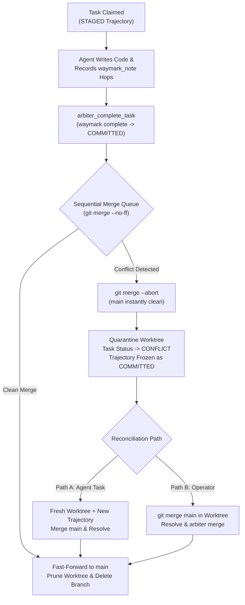

# Arbiter — Multi-Agent Task Orchestration Engine

Arbiter is a local-first, zero-daemon multi-agent orchestration engine and ephemeral Git worktree supervisor. It coordinates parallel AI coding agents across isolated Git worktrees with in-flight continuity powered by **Waymark** and episodic memory integration powered by **Capn**.

---

## Architectural Principles

1. **Zero-Daemon Overhead**:
   Arbiter uses Node.js 22 built-in native SQLite (`node:sqlite`) for ACID state, dependency graphs, and worker leases. There are no background server ports, daemon daemons, or long-running database containers.
2. **Ephemeral Worktree Isolation**:
   Every task runs in an isolated Git worktree under `.arbiter/worktrees/task-<id>` checked out to dedicated branch `arbiter/task-<id>`. Parallel agents never touch the main working copy directly and never experience cross-agent file pollution.
3. **In-Flight Continuity via Waymark**:
   When an agent claims a task, Arbiter automatically bootstraps Waymark inside the task worktree. Every file hop and code discovery can be recorded with `waymark_note`, surviving context compaction. Trajectories are sealed prior to merging.
4. **Autonomous Crash & Lock Recovery**:
   Arbiter's synchronous lease watchdog inspects worker PID liveness (`process.kill(pid, 0)`). If an agent crashes or abandons a task, Arbiter reclaims the orphaned Waymark lock via `waymark_recover_lock({ force: true })` and resets the task to `READY`.
5. **Sequential Merge Queue with Quarantine**:
   Completed tasks are sequentially merged to `main`. If merge conflicts arise, Arbiter cleanly rolls back (`git merge --abort`), isolates the task in `CONFLICT` quarantine, and preserves the worktree for inspection.

---

## Dual Interface

### Agent MCP Server (`arbiter-mcp`)
Agents interact with Arbiter over stdio using standard JSON-RPC 2.0 MCP tools:
- `arbiter_submit_task`: Submit DAG tasks with dependencies.
- `arbiter_claim_task`: Claim next ready task and provision worktree.
- `arbiter_checkpoint`: Record progress and refresh lease heartbeat.
- `arbiter_complete_task`: Finalize work, seal Waymark, and commit.
- `arbiter_fail_task`: Abandon trajectory and report error.
- `arbiter_recover_lock`: Reclaim orphaned lock.
- `arbiter_status`: Query queue or inspect specific task.
- `arbiter_process_merge_queue`: Sequentially merge completed tasks.
- `arbiter_scan_leases`: Scan leases for dead PIDs or timeouts.
- `arbiter_prune_worktrees`: Clean up completed worktrees.

### Operator CLI (`arbiter`)
Human operators and automation scripts can run:
```bash
arbiter submit --title "<title>" [--description "<desc>"] [--deps "<task1,task2>"]
arbiter claim [--worker <id>]
arbiter checkpoint --task <id> --worker <id> --message "<msg>"
arbiter complete --task <id> --worker <id> --answer "<answer>"
arbiter status [<task-id>]
arbiter merge [<task-id>] [--target <branch>]
arbiter watchdog [--timeout <sec>]
arbiter prune
```

---

## Waymark Trajectory Conflict Handling & Quarantine Lifecycle

A critical invariant of Arbiter is that **Git merge conflicts never corrupt, mutate, or destroy Waymark trajectories**. The lifecycle of a conflicted task and its underlying trajectory follows a strict fail-closed sequence:



### 1. Pre-Merge Invariant: The Trajectory is Already Sealed
Merges are **never** attempted while a trajectory is active. When an agent calls `arbiter_complete_task`:
1. **Trajectory Sealing**: Arbiter executes `waymark complete <id> <answer>` inside the task worktree. This writes a `trajectory.committed` event to `.waymark/events.jsonl`, transitioning trajectory status from `STAGED` to **`COMMITTED`**. The trajectory is permanently immutable—no further hops can be added.
2. **Worktree Commit**: Arbiter commits modified files to `arbiter/task-<id>`.
3. **Database Transition**: Task status is marked `COMPLETED` in SQLite, worker leases are released, and the task is enqueued in the sequential merge queue.

### 2. Conflict Detection & Main Branch Protection
When `MergeQueue.mergeTask(taskId, targetBranch = "main")` processes the branch:
- **Immediate Rollback (`git merge --abort`)**: If parallel tasks touched overlapping lines and Git returns a non-zero exit code, Arbiter synchronously aborts the merge. This guarantees `main` is **never** left with conflict markers or a dirty index.
- **Zero-Pollution Invariant**: The main working tree instantly returns to its pre-merge HEAD commit.

### 3. Worktree Quarantine vs. Worktree Pruning
- **Clean Merge**: The branch is merged into `main`, and Arbiter automatically prunes the worktree (`git worktree remove --force`) and deletes the task branch.
- **Conflict Quarantine**: Arbiter **preserves** the entire worktree at `.arbiter/worktrees/task-<id>` and its branch. The task status transitions to `CONFLICT`, and a `task.conflict` audit event is logged with Git's conflict diagnostics.

### 4. Forensic State of the Waymark Trajectory
Inside the quarantined worktree, `.arbiter/worktrees/task-<id>/.waymark/` remains completely intact in a frozen forensic state:
1. **Immutable Audit Trail**: The trajectory remains in `COMMITTED` status. All hops, file spans, relocation hashes, and the worker's synthesis answer are preserved on disk for inspection.
2. **Fail-Closed Mutation Lock**: Any subsequent attempt to call `waymark note` inside the quarantined directory fails with `TRAJECTORY_NOT_STAGED` (exit code 2).
3. **Provenance Drift Detection**: If an agent attempts to inspect or resume the trajectory, Waymark compares the recorded base HEAD commit against the current HEAD. Because other tasks have merged into `main`, Waymark flags `CROSS_BRANCH` provenance drift.

### 5. Resolution & Reconciliation Pathways

#### Path A: Automated Child Reconciliation Task (Agent Flow)
1. Submit a downstream reconciliation task:
   ```bash
   arbiter submit --title "Reconcile task-<id> with main" --deps "task-<id>"
   ```
2. A new agent claims the task, receiving a **fresh worktree** and a **brand-new Waymark trajectory**.
3. The agent reads the prior task's synthesis answer from SQLite, runs `git merge main` inside its worktree, resolves the conflict, records verified hops under its own trajectory, and completes the task.

#### Path B: Operator Manual Intervention (Operator Flow)
1. Navigate to the preserved quarantined worktree:
   ```bash
   cd .arbiter/worktrees/task-<id>
   git merge main
   ```
2. Resolve conflict markers in the affected files and commit:
   ```bash
   git add -A && git commit -m "Merge main and resolve conflicts"
   ```
3. Re-trigger the merge queue:
   ```bash
   arbiter merge task-<id>
   ```
4. Arbiter merges the reconciled branch into `main`, updates task status to `COMPLETED`, and prunes the quarantined worktree.
